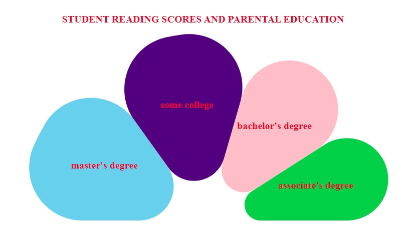

# Layouts
- Learned how to create pie, doughnut, stackedbar and stacked area charts

## Dataset
- Used dataset from Kaggle that measured student study performance along with the explanatory variables, such as gender, ethnicity, parent level of education, lunch, & test prep course. Dataset has 1000 rows of data with no missing information. 

<a href="https://www.kaggle.com/datasets/bhavikjikadara/student-study-performance" target="blank">Dataset created by Bhavik Jikadara</a> 

## Aim of visualization 
- Ideally, I wanted to show the averages of all scores (reading, writing, and math) based on parent education level, but I was not sure how to show multiple columns in one chart (not like the line chart where it was separate columns per line). 
- I used the pie code template from class and the chart had 1000 slices and was completely ineffective.  
- Next, I tried to calculate the averages. I looked online for a function to calculate average, but the console log returned NaN.
- So, I created a splice of the array and took the first 4 positions
- I was able to produce a chart, but the problem is that the amounts are not averages, they are the individual reading scores attached to that row of parent education level. If you add more index positions, than the parental education categories begin to repeat individually. Essentially, the data here is **biased**. 
- I added some start/end angles, and corner radius to make the chart look a little more interesting. 
  

