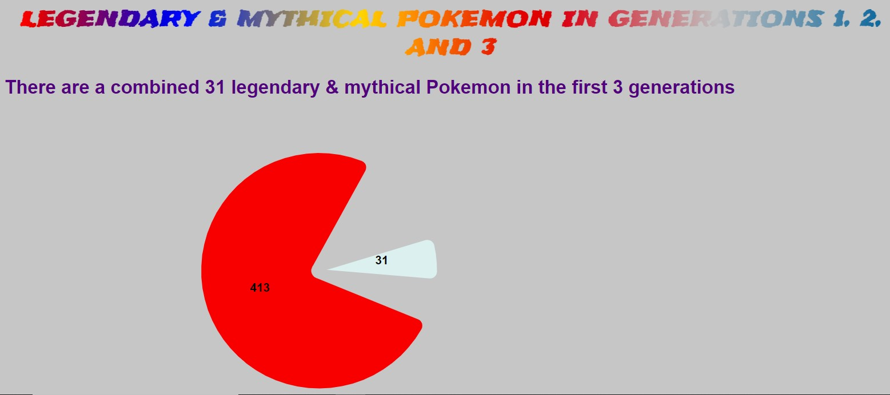
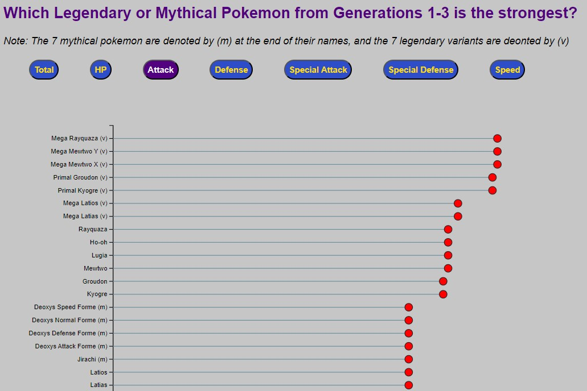
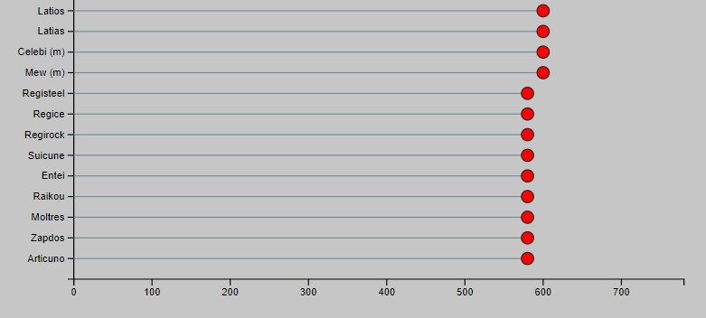
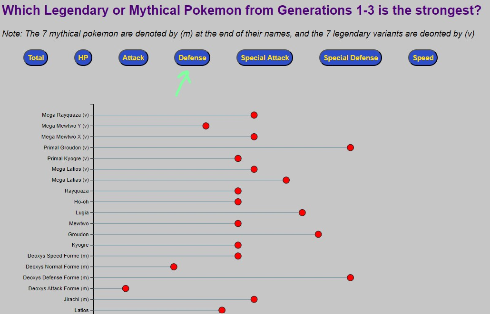
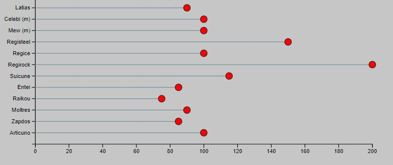

# Legendary Pokemon stats

## Dataset
I wanted to create a visualization about Legendary Pokemon. So I found a dataset on kaggle that lists all Pokemon in the first 8 generations (there are currently nine), including the variants. I limited the data to the first 3 generations, of which I am the most familiar. 
Dataset from Jai Dalmnotra - [source](https://www.kaggle.com/datasets/jaidalmotra/pokemon-dataset) 

## Visualization
The first viz is a static pie chart depicting the amount of legendary pokemon (31) in the first 3 generations versus "regular". 

The second viz is an interactive lollipop chart showcasing the seven stats of said legendary Pokemon. Inspiration for this viz is from [D3 Graph Gallery](https://d3-graph-gallery.com/graph/lollipop_button_data_csv.html) 
The viewer gets to decide which one is actually best.

## Review
Overall, I completed my goal of creating a pie chart and interactive lollipop. However, there were many stylistic touches that would have made this project much stronger. 

