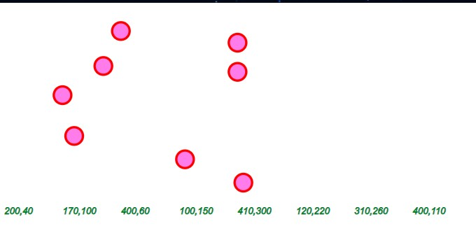

# Homework 2
## Aim
Reinforce knowledge of SVGs by creating a basic scatter plot with the "circle" SVG.

**Circles have 3 attributes or arguments**
- cx (x-position)
- cy (y-position)
- r (radius)

Then we will use code to create text labels that display the circle coordinates along with some other styling, like position and font-size.

After much frustration, I was able to generate the scatter plot, however, the text labels are difficult to re-position. They are stuck at the top left corner of the screen. 

