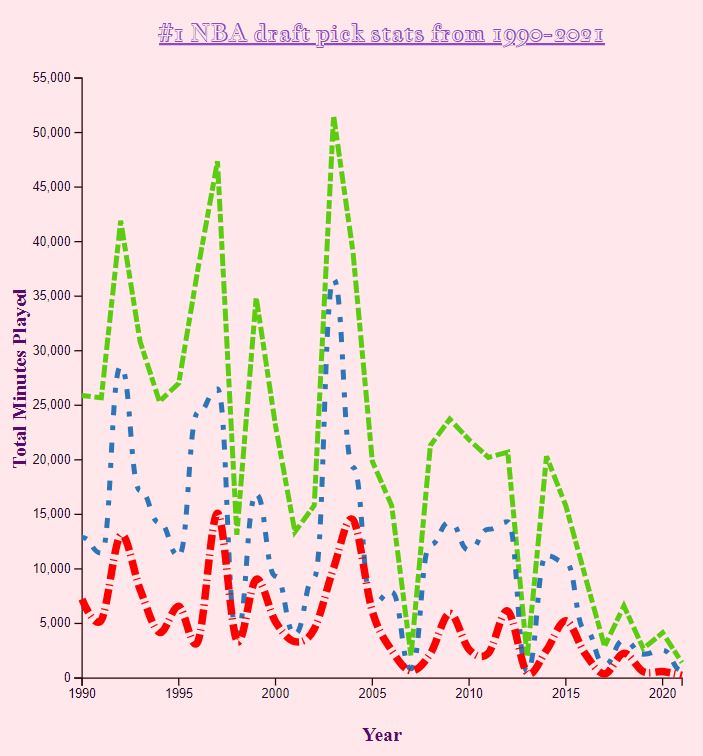

# d3.line generator

## Dataset
- Obtained dataset from Kaggle that looks at all NBA draft picks from 1990-2021
- [Dataset](https://www.kaggle.com/datasets/benwieland/nba-draft-data) by Ben Wieland

### Cleaning data
1. Filtered out any players that never played after being drafted (NA in Years column)
2. Filtered down to number 1 picks of each team for each year, from 1990-2021 (original dataset contained all picks and it was too large N=1868. Filtered data now has n=32)
3. Renamed some of the columns because I did not know all the acronyms. 
4. After importing the data, used unary operator to convert desired columns to string
5. Parsed draft year

### Drawing
- Was able to create the second line - had a spelling mistake while formatting the data
- Wanted to draw a line that pointed to the line peaks but was unsuccessful

### Chart
Graph shows the total minutes played (green), total points scored (blue), and total rebounds (red) for the #1 NBA draft picks, from 1990-2021. Lebron James, drafted in 2003, leads in the first two categories at 51,563 minutes & 36,559 points scored, respectively.  

