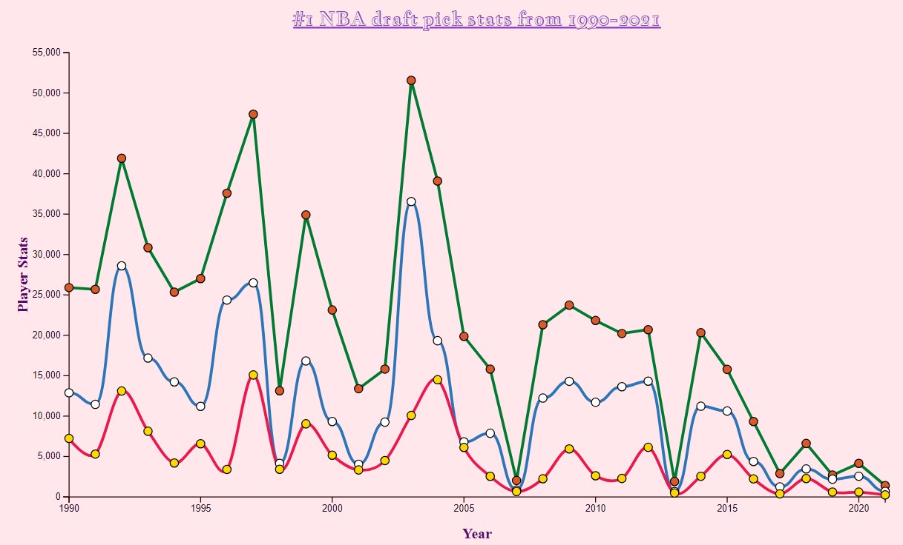
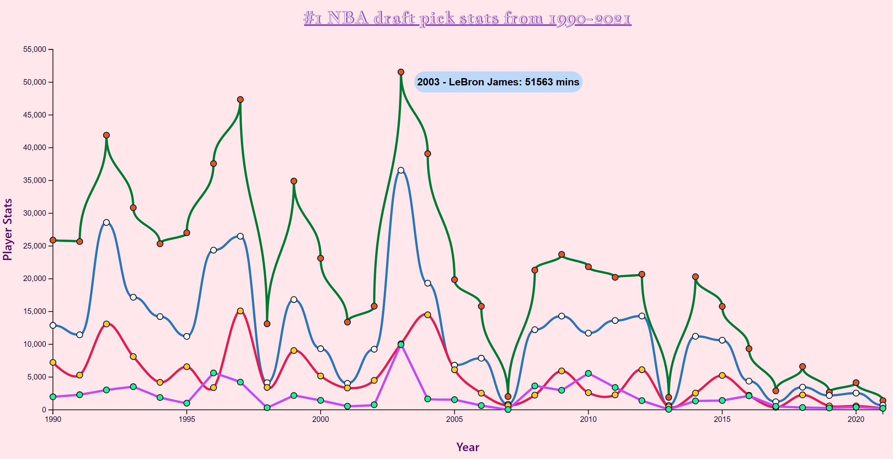
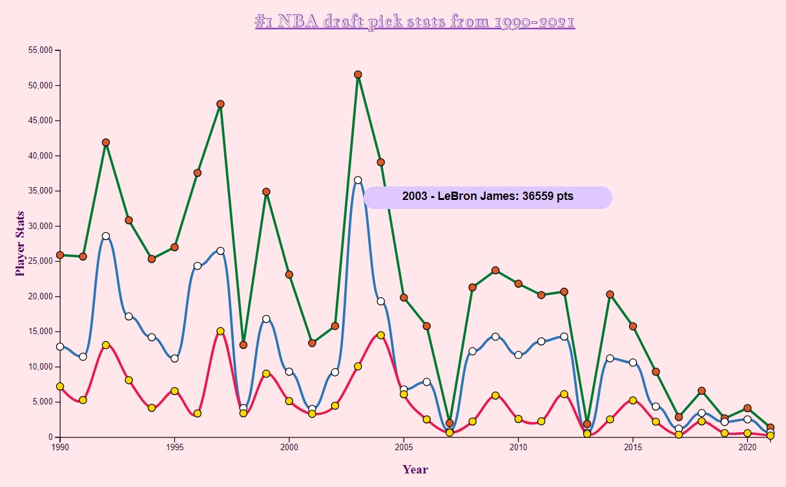
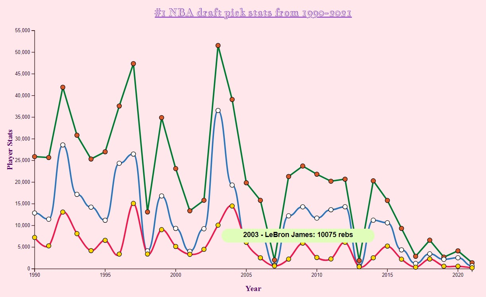

# Adding interactivity to charts
## Dataset
- Obtained dataset from Kaggle that looks at all NBA draft picks from 1990-2021
- [Dataset](https://www.kaggle.com/datasets/benwieland/nba-draft-data) by Ben Wieland

## Cleaning data
1. Filtered out any players that never played after being drafted (NA in Years column)
2. Filtered down to number 1 picks of each team for each year, from 1990-2021 (original dataset contained all picks and it was too large N=1868. Filtered data now has n=32)
3. Renamed some of the columns because I did not know all the acronyms. 
4. After importing the data, used unary operator to convert desired columns to string
5. Parsed draft year
6. Added a column called YrPicked because when I tried to use the DraftYear column, it would show a full Javascript date OR it would be null.

## Plan 
- Take the chart from week 7 and add interactivity - hover with tooltip, so the user can see the values for total minutes, points, and rebounds of all #1 draft picks from 1990 to 2021. 
- Increased the width so the lines aren't bunched up together
- Changed line colors to follow more NBA team colors
- Had to create three different variables for
    1. Lines
    2. Paths
    3. Tooltips
    4. Circles (symbols)

Original static pic from week 7
 

I removed dash array and used solid lines because I would be adding points and tooltips, so I didn't want the charts to be too busy.

Redesigned chart before interaction

Hover & tooltip 1 - total minutes played

Hover & tooltip 2 - total points 

Hover & tooltip 3 - total rebounds
